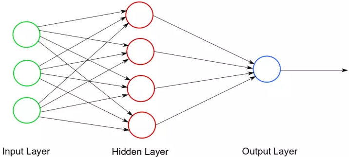
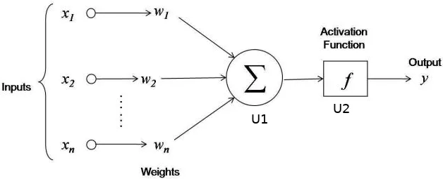

# Feedforward Neural Network - Theoretical Introduction
## Network
- Comprises neurons connected by synapses
- Neurons transmit data between each other
- Consists of 3 layers:
	- Input layer (receives input data for computation)
	- Hidden layer (responsible for computations)
	- Output layer (receives the computation result)
- Each synapse has an associated weight
	- Weight determines how strongly the transmitted value affects the final computation result
- To transmit a value, a synapse first reads the value from the input neuron, then multiplies it by the weight, and sends the result to the output neuron
- The output neuron performs computations on the values provided by synapses and passes the result to its outgoing synapse



## Training
- The goal (in simplification) is to adjust the appropriate weights for synapses
- An iterative process
	- One iteration consists of two steps: **forward propagation** and **backpropagation**

### Forward Propagation
- Involves performing computations on input data using weights assigned to synapses

### Backpropagation
- Measures the error associated with the propagation result (by comparing it with the expected computation results, i.e., the training data)
- Depending on the measured error, synapse weights are modified

# In this Project

This section will present how a simple neural network implementing the concepts described in the introduction was constructed.

**Problem:** Determine whether a three-bit positive binary number is even or odd.

| Input Data | Expected Output |
|------------|-----------------|
|     010    |        1        |
|     101    |        0        |
|     110    |        1        |

## Neural Network Structure

- **Input Layer**
	- 3 neurons
	- Each neuron corresponds to a value of one bit from the binary representation of the input number
- **Hidden Layer**
	- 2 neurons
	- N1 (sums all the numbers sent to it with appropriate weights by incoming synapses and passes this sum to neuron N2)
	- N2 (applies an activation function to the received result and passes it to the output layer)
	- The weight of the synapse from N1 to N2 is 1



## Propagation

- Weights have a predetermined value during the first propagation (each of them is initialized randomly from the range -1;1, while their expected value must be 0)
### Initial - N1
- First, neurons from the input layer are initialized with bits of the input number
- Then, the value of each neuron from the input layer is multiplied by the corresponding weight and sent to N1
- N1 sums all 3 values
### N2 - end
- N2 interprets the results obtained from N1 by applying the activation function - sigmoid
- **For example:** if N1 receives the number 332248, our neural network will predict with high probability that the correct result for the given 3 bits is 1, whereas if N1 calculates the value as -53321, our network will predict that the correct result is 0. If N1 calculates the value as 0, our network won't be able to determine the result.

## Backpropagation

- **Example**
	- Let's assume we perform one iteration of the training process for the pair (110, 1)
	- 110 - input data
	- 1 - expected result
	- Let R be the value calculated in neuron N2 for this input data and current synapse weights
	- We start backpropagation by checking how much the calculated value during propagation differs from the expected result
	- Then, depending on the obtained error, we adjust synapse weights
	- `d_sigmoid(R)` is the sigmoid derivative at point R
```
error = R - expected_result
weight = weight + expected_result * error * d_sigmoid(R)
```
